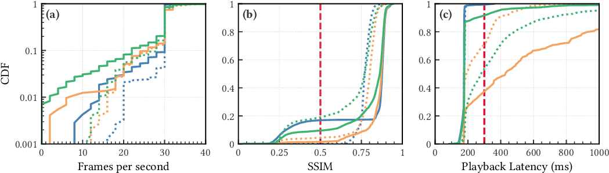

# Analyzing Real-time Video Delivery over Cellular Networks for Remote Piloting Aerial Vehicles

Aygün Baltaci<sup>1,2</sup>, Hendrik Cech<sup>1</sup>, Nitinder Mohan<sup>1</sup>, Fabien Geyer<sup>2</sup>, Vaibhav Bajpai<sup>3</sup>, Jörg  Ott<sup>1</sup>, Dominic Schupke<sup>2</sup>

<sup>1</sup>Technical University of Munich, <sup>2</sup>Airbus, <sup>3</sup>CISPA Helmholtz Center for Information Security

---

This repository contains the scripts and programs that we developed for our publication “Analyzing Real-time Video Delivery over Cellular Networks for Remote Piloting Aerial Vehicles” that was presented at the [ACM Internet Measurement Conference 2022](https://conferences.sigcomm.org/imc/2022/).
It contains scripts to [generate the figures](#paper-figures) contained in our paper, the scripts that [drove our measurements](#measurement-scripts), and the [parsers](#measurement-log-processing) to assemble the reported metrics.


### Video delivery pipeline
The application that we used to deliver video with an adaptive bitrate over LTE is available at [hendrikcech/imc22-video-pipeline](https://github.com/hendrikcech/imc22-video-pipeline) along with setup and usage instructions.
It makes use of the [gst-timecode](https://github.com/hendrikcech/gst-timecode) GStreamer element.


### Dataset
The dataset that we built by conducting drone flights is available for download at [mediaTUM](https://mediatum.ub.tum.de/1687221). It contains an SQLite database where we aggregated the collected metrics. We ask you to cite our IMC'22 paper upon use.

``` bibtex
@inproceedings{uavIMC2022,
    author={Baltaci, Ayg{\"u}n and Cech, Hendrik and Mohan, Nitinder and Geyer, Fabien and Bajpai, Vaibhav and Ott, J{\"o}rg and Schupke, Dominic},
    title={{Analyzing Real-time Video Delivery over Cellular Networks for Remote Piloting Aerial Vehicles}},
    booktitle={Proceedings of Internet Measurement Conference},
    publisher={Association for Computing Machinery},
    address={New York, NY, USA},
    url={https://doi.org/10.1145/3517745.3561465},
    doi={10.1145/3517745.3561465},
    year={2022},
    series={IMC '22}
}
```

## Paper Figures



The figures contained in our paper can be generated with the following steps.

### Step 1: Download the dataset
Please visit our [mediaTUM](https://mediatum.ub.tum.de/1687221) publication and download our dataset. It contains a SQLite database from which the plotted data is retrieved.

### Step 2: Set up Python
We used Python version 3.10.5 to generate the plots. Install the required packages listed in `requirements.txt` either system-wide or in a virtual environment as described below.

``` python
pip3 -m venv venv
source venv/bin/activate
pip3 install -r requirements.txt
```

### Step 3: Run the scripts
Each plot is generated by a separate script contained in `figures/`. To generate all figures, run `plot_all.sh` with the location of the extracted SQLite database as the first argument. You will find the generated figures in a new directory called `figures_pdf`.

## Measurement scripts
The directory `measurements/` contains the scripts that we used to collect data during our UAV flights. Some scripts open a SSH connection to the remote server, using the SSH alias `aws`. The unique measurement device id is read from `/boot/pi_id` which is a text file containing a number.

``` sh
measurements/
├── helpers
│   ├── info.sh
│   ├── iso_date.sh
│   └── tcpdump.sh
├── iperf_server.sh 
├── iperf.sh         # Executed on the client. Uses SSH to execute
│                    # iperf_server.sh on the server.
│
├── ping.sh          # Executes ICMP or TCP pings.
├── roq_play.sh
├── roq_serve.sh     # Executed on the client. Starts roq_play.sh on the server.
├── test-roq.sh      # Starts tcpdump and roq_serve.sh with the selected 
│                    # CC algorithm (static, GCC, or SCReAM).
└── test-utils.sh
```

## Measurement log processing
The folder `parsers` contains scripts to parse the measurement artifacts that are available at
[mediaTUM](https://mediatum.ub.tum.de/1687221).
The tool [GNU parallel](https://www.gnu.org/software/parallel/) can be useful to speed up the computation of metrics.
By following the listed steps, the relevant metrics are computed and finally compiled into a SQLite database that can be queried easily.

In the following examples, we use two environment variables:
``` sh
DATASET=./imc22-dataset  # Path to the downloadeded mediaTUM dataset
SCRIPTS=./imc22-scripts  # Path to this repository
```

### Compute SSIM
The SSIM is computed by comparing the source video and the received video.
The computation can take a while so we recommend to run multiple computations in parallel.
While running, the SSIM results are written next to the receiver video file.
``` sh
parallel -j 20 --eta "$SCRIPTS/parsers/ssim.py" "$DATASET/video/train_30.mp4" "{}" --method qr --save ::: "$DATASET"/220*/*/*server.avi
```

### Compute latency of RTP and ping packets

``` sh
ping_pcaps() {
    PCAPS_PI="$(find "$DATASET"/220* -iname '*ping*pi.pcap')"
    for PCAP_PI in $PCAPS_PI; do
        cd "$(dirname "$PCAP_PI")"
        PCAPS_SERVER=( *server*pcap ) # use first pcap
        echo "$PCAP_PI"
        echo "$(pwd)/$PCAPS_SERVER"
    done
}
export -f ping_pcaps

parallel -N 2 "$SCRIPTS/parsers/pcap_latency_loss.py" "{1}" "{2}" ::: \
    $(ping_pcaps)

parallel -N 2 "$SCRIPTS/parsers/pcap_latency_loss.py" "{1}" "{2}" ::: \
    "$DATASET"/220*/*/*roq*rtp.pcap
```

### Populate the SQLite database
Import all csv files into a new SQLite database `db.sqlite3`.
``` sh
find "$DATASET"/220* -type f -iname '*csv' \
    -exec "$SCRIPTS/parsers/roq.py" "{}" db.sqlite3 \;

# Populate table 'ping'
find "$DATASET"/220* -type f -iname '*ping*txt' \
    -exec "$SCRIPTS/parsers/roq.py" "{}" db.sqlite3 \;

# Populate table 'flight'
find "$DATASET/flight_logs" -type f -iname '*csv' \
    -exec "$SCRIPTS/parsers/flight.py" "{}" db.sqlite3 \;

# Populate table 'modem'
for PI in 1 2 3 4 5 6; do
    find "$DATASET/lte_ue_logs" -type f -iname "*_${PI}_*log" \
        -exec "$SCRIPTS/parsers/modem_log.py" db.sqlite3 "$PI" "{}" \;
done

# Populate table 'handovers'
for PI in 1 2 3 4 5 6; do
    for MNO in P1 P2; do
        find "$DATASET/lte_ue_logs" -type f -iname "*${PI}_${MNO}.pcap" \
            -exec "$SCRIPTS/parsers/modem_pcap.py" "$PI" "$MNO" "{}" db.sqlite3 \;
    done
done

```

Add information to the “notes” column of the static tests.
``` sql
UPDATE `index` SET notes = '5 Mbps'  WHERE day='220217U' AND flight=4 AND pi=6;
UPDATE `index` SET notes = '10 Mbps' WHERE day='220217U' AND flight=5 AND pi=6;
UPDATE `index` SET notes = '15 Mbps' WHERE day='220217U' AND flight=6 AND pi=6;
UPDATE `index` SET notes = '20 Mbps' WHERE day='220217U' AND flight=7 AND pi=6;

UPDATE `index` SET notes = '15 Mbps' WHERE day='220313U' AND flight=1 AND pi=6;
UPDATE `index` SET notes = '25 Mbps' WHERE day='220313U' AND flight=2 AND pi=6;
UPDATE `index` SET notes = '25 Mbps' WHERE day='220313U' AND flight=5 AND pi=6;
UPDATE `index` SET notes = '25 Mbps' WHERE day='220313U' AND flight=9 AND pi=6;

UPDATE `index` SET notes = '10 Mbps' WHERE day='220323R' AND flight=2 AND pi=5;
UPDATE `index` SET notes = '10 Mbps' WHERE day='220323R' AND flight=2 AND pi=6;

UPDATE `index` SET notes = '25 Mbps' WHERE day='220323R' AND flight=3 AND pi=5;
UPDATE `index` SET notes = '8 Mbps' WHERE day='220323R' AND flight=3 AND pi=6;

UPDATE `index` SET notes = '25 Mbps' WHERE day='220323R' AND flight=6 AND pi=5;
UPDATE `index` SET notes = '8 Mbps'  WHERE day='220323R' AND flight=6 AND pi=6;

UPDATE `index` SET notes = '8 Mbps'  WHERE day='220323R' AND flight=12 AND pi=6;
UPDATE `index` SET notes = '12 Mbps' WHERE day='220323R' AND flight=13 AND pi=6;
```

